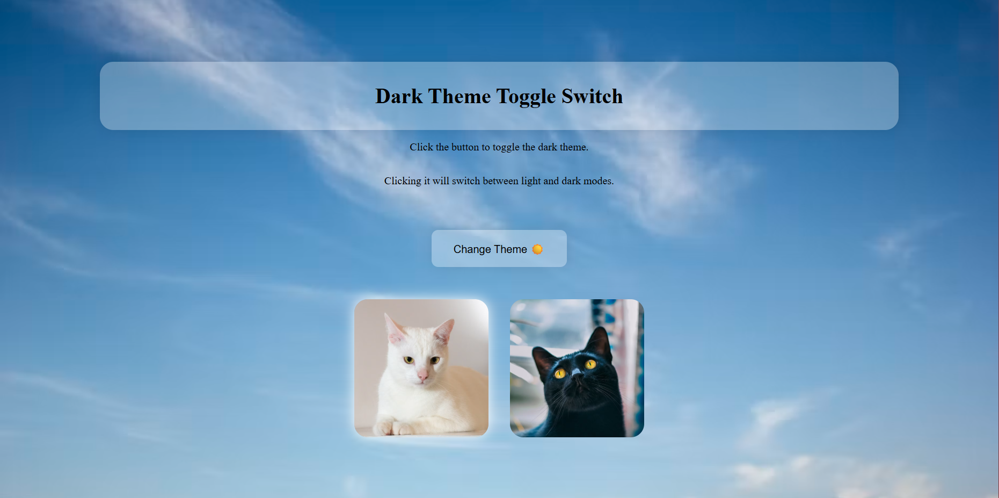
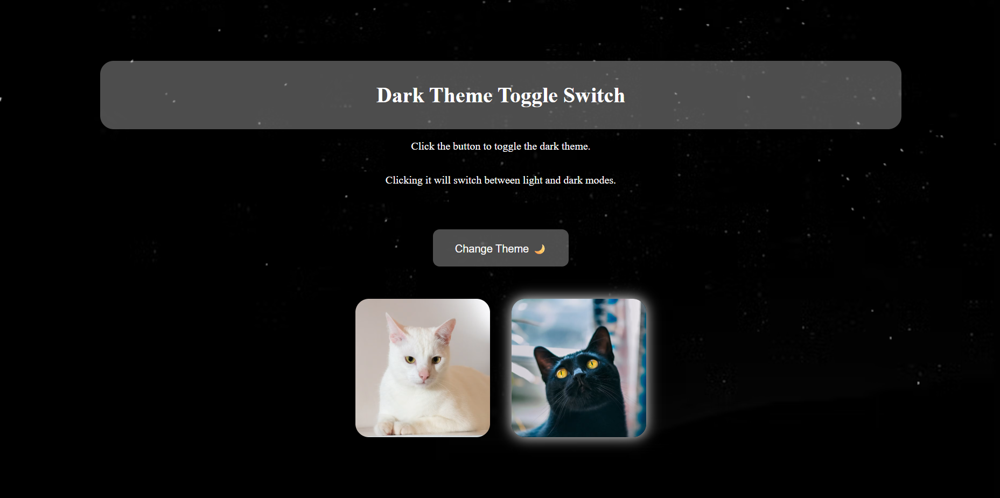

# Dark Theme Toggle

A polished, lightweight website feature that instantly switches between light and dark themes with a single click.

This toggle has cute cat pictures which lighten-up according to the theme. And also the background goes from day to night sky when clicked the "Change Theme" button.

## Why it works

- Instant theme switching for a better user experience
- Eye-friendly design for both bright and low-light environments
- Clean, minimal styling that feels modern and professional
- Easy to integrate into a simple front-end project

## Preview

### Light mode

### Dark mode

Please Enjoy Toggling!!!